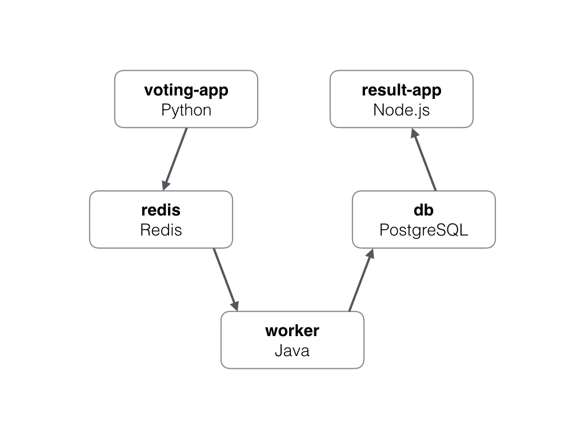

本项目是docker2016年发布大会上，被用来做debug in docker演示的项目。原项目的仓库已经被删除。我在github上搜到了这个仓库fork下来，以便保存。有兴趣的同学可以去youtobe看一下这个[**发布会视频**](https://www.youtube.com/watch?v=vE1iDPx6-Ok&feature=youtu.be&list=PLkA60AVN3hh9gnrYwNO6zTb9U3i1Y9FMY&t=2088)。自备梯子哦^^!。

Instavote
=========

Getting started
---------------

Download [Docker for Mac or Windows](https://www.docker.com).

Run in this directory:

    $ docker-compose up

The app will be running at [http://localhost:5000](http://localhost:5000), and the results will be at [http://localhost:5001](http://localhost:5001).

Architecture
-----

* A Python webapp which lets you vote between two options
* A Redis queue which collects new votes
* A Java worker which consumes votes and stores them in…
* A Postgres database backed by a Docker volume
* A Node.js webapp which shows the results of the voting in real time

